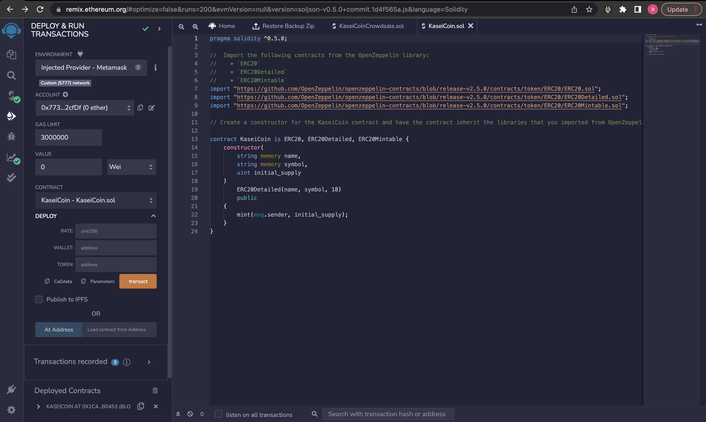
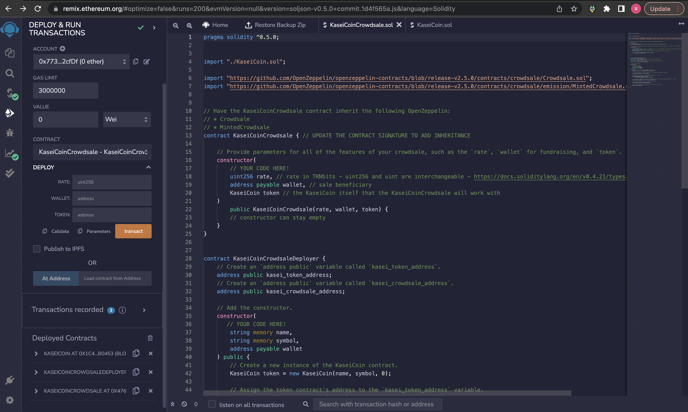
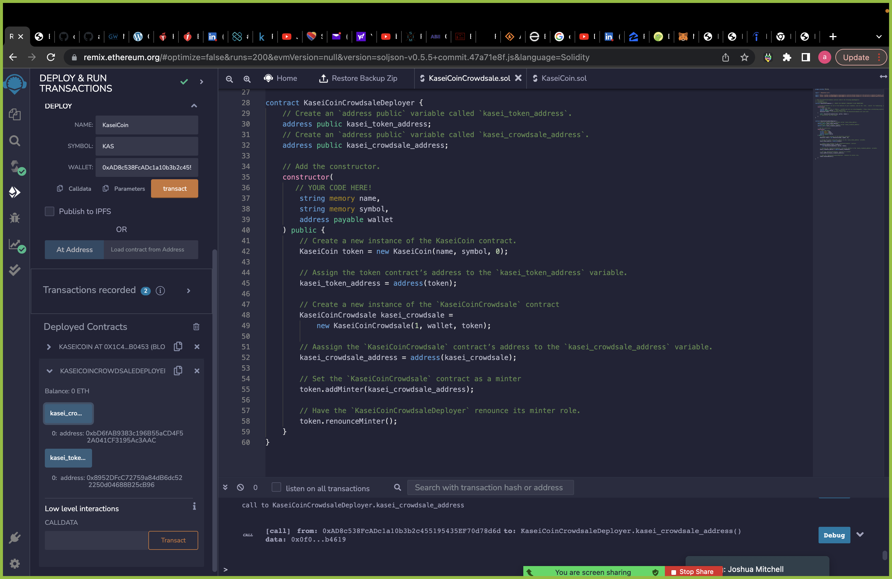
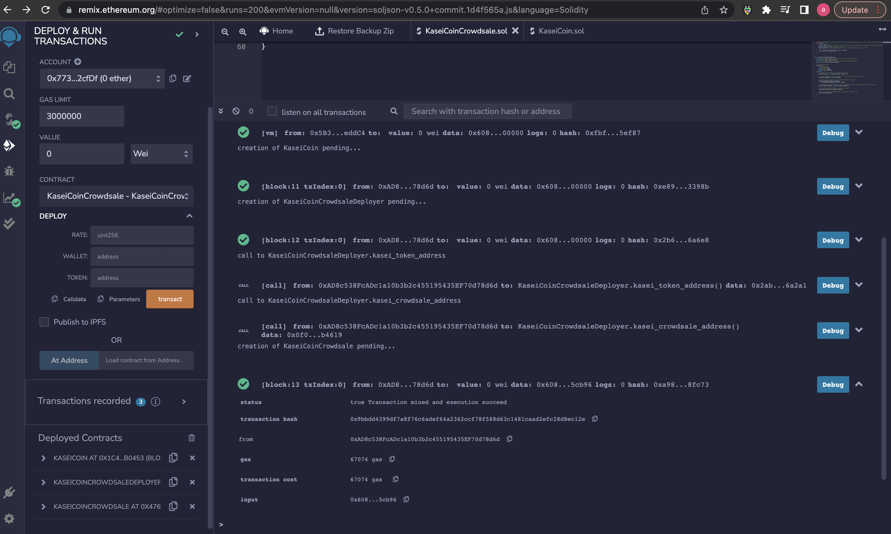

# Application

## Challenge: Martian Token Crowdsale

This project produces a fungible token that is ERC-20 compliant and that will be minted by using a `Crowdsale` contract from the OpenZeppelin Solidity library.

The crowdsale contract manages the entire crowdsale process, allowing users to send ether to the contract and in return receive KAS, or KaseiCoin tokens. Your contract will mint the tokens automatically and distribute them to buyers in one transaction.

## Technologies

The following Technologies were used to develop this program:

Solidity

Terminal
    Version 2.12.5 (444)

Visual Studio Code
    Version: 1.66.2 (Universal)
    Commit: dfd34e8260c270da74b5c2d86d61aee4b6d56977
    Date: 2022-04-11T07:49:20.994Z
    Electron: 17.2.0
    Chromium: 98.0.4758.109
    Node.js: 16.13.0
    V8: 9.8.177.11-electron.0
    OS: Darwin x64 21.4.0

---

### Instructions

The steps for this project  are divided into the following sections:

1. Create the KaseiCoin Token Contract

2. Create the KaseiCoin Crowdsale Contract

3. Create the KaseiCoin Deployer Contract

4. Deploy the Crowdsale to a Local Blockchain

#### Create the KaseiCoin Token Contract

#### Create the KaseiCoin Crowdsale Contract AND Deployer Contract

#### Deploy the Crowdsale to a Local Blockchain

#### Libraries Used
 

Solidity

Python

---

#### Contributors

#### Antiwan Maxwell
#### Contact Infromation:

email: antiwan.maxwell@outlook.com

[LinkedIn](https://www.linkedin.com/in/antiwan-maxwell-205a11233/)

---

## License

