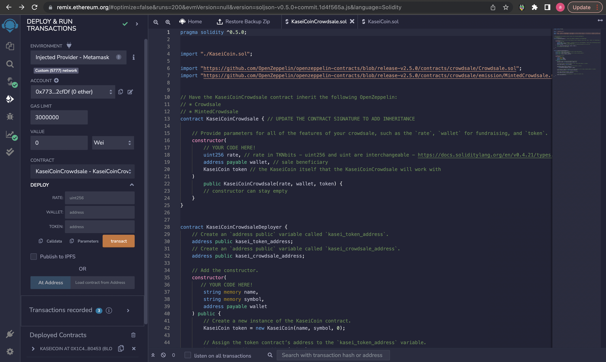

# Application

## Challenge: Martian Token Crowdsale

This project produces a fungible token that is ERC-20 compliant and that will be minted by using a `Crowdsale` contract from the OpenZeppelin Solidity library.

The crowdsale contract manages the entire crowdsale process, allowing users to send ether to the contract and in return receive KAS, or KaseiCoin tokens. Your contract will mint the tokens automatically and distribute them to buyers in one transaction.

### Instructions

The steps for this project  are divided into the following sections:

1. Create the KaseiCoin Token Contract

2. Create the KaseiCoin Crowdsale Contract

3. Create the KaseiCoin Deployer Contract

4. Deploy the Crowdsale to a Local Blockchain

5. Optional: Extend the Crowdsale Contract by Using OpenZeppelin

#### Create the KaseiCoin Token Contract

#### Create the KaseiCoin Crowdsale Contract AND Deployer Contract

#### Deploy the Crowdsale to a Local Blockchain

